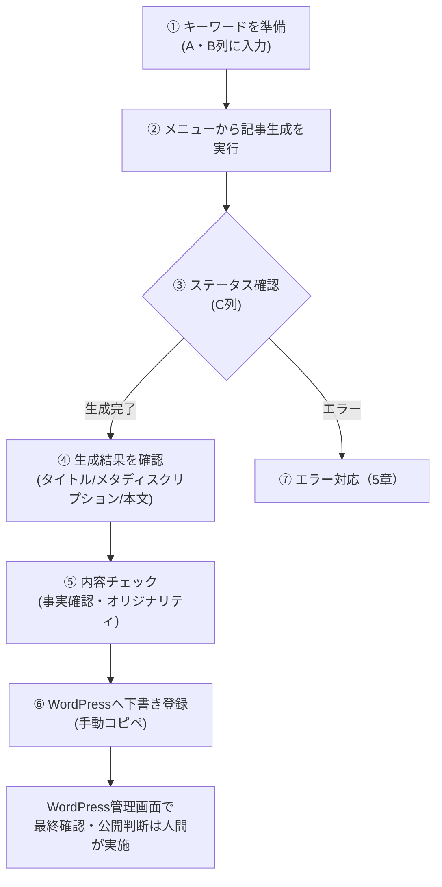

# 運用手順書 — ブログ記事自動生成システム

| 項目 | 内容 |
|---|---|
| 文書種別 | 運用手順書 |
| 対象読者 | 記事生成を実際に運用する担当者（クライアント側の運用担当者を想定） |
| 前提 | 導入・初期設定は完了済みであること（[README](../README.md) の「セットアップ手順」参照） |
| 関連文書 | [要件定義書](./requirements-definition.md)（WordPress連携仕様含む） / [提案書](../requirements.md) / [納品物一覧](./deliverables.md) |
| 作成日 | 2026-08-05 |

> 本書は「導入時に1回だけ行う設定」ではなく、**週次のブログ更新サイクルの中で繰り返し行う運用作業**をまとめたものです。初期設定手順は [README](../README.md) を参照してください。

---

## 1. 通常運用フロー（週次サイクル）

### ① キーワードを準備する
- 「記事リスト」シートのA列に**キーワード**、B列に**サブキーワード**（任意）を入力する。
- 既に処理済みの行（C列が「生成完了」「エラー」）はそのまま残しておいてよい。新しい行だけを追加すればよい（C列が空欄または「未生成」の行のみが処理対象になる）。

### ② メニューから記事生成を実行する
- スプレッドシート上部メニュー「記事自動生成 > 未処理のキーワードを一括生成」をクリックする。
- 実行中はC列が「生成中」になる。処理件数が多い場合は数分かかる（1行あたりOpenAI APIへのリクエストが1〜2回発生する）。

### ③ ステータスを確認する
- 実行完了後、アラートで「成功○件 / エラー○件」が表示される。
- C列を見て、「生成完了」になった行と「エラー」になった行を確認する。

### ④⑤ 生成結果を確認・チェックする
- D列（タイトル）、E列（メタディスクリプション）、F列（本文HTML）を確認する。
- 公開前に必ず行うチェック（[README「運用上の注意」](../README.md#運用上の注意) にも記載）:
  - **事実確認**: 数値・法令・統計等、AIが誤って生成していないか
  - **オリジナリティ確認**: [CopyContentDetector](https://ccd.cloud/) 等でコピペチェックを実施
  - **トーン確認**: クライアントのブログとして違和感がないか
  - **文字数**: 本文が2,000文字以上あるか（自動保証されているが念のため目視）

### ⑥ WordPressへ下書き登録する（今回のスコープでは手動）
本システムは[要件定義書 3.3節](./requirements-definition.md#33-今回のスコープでの扱い)のとおり、WordPressへの**自動投稿は行わない**設計です。したがって現状は以下の手動手順で下書き登録します。

1. Apps Scriptエディタで「実行数」（または実行後の「ログ」）を開き、`--- WordPress送信ペイロード（未送信・確認用） ---` を探す。
2. ログに出力された `title` / `content` / `excerpt` の内容を確認する。
3. WordPress管理画面 > 投稿 > 新規追加 を開き、タイトル・本文・抜粋（メタディスクリプション相当）を貼り付ける。
   - 本文はHTML断片（`<h2>` / `
`）なので、WordPressの「コードエディター」モード、または「カスタムHTML」ブロックに貼り付ける。
4. ステータスを「下書き」のまま保存する（**公開しない**）。
5. 担当者が最終レビュー後、WordPress側で公開操作を行う。

> 将来的に手動コピペを廃止し、REST API経由で自動的に下書き登録したい場合は、[要件定義書 3.4節](./requirements-definition.md#34-実投稿を有効化する場合の変更点将来対応)の手順で有効化する。

## 2. 定期メンテナンス

| 作業 | 頻度 | 内容 |
|---|---|---|
| OpenAI API利用状況の確認 | 月1回 | [OpenAI Platform](https://platform.openai.com/usage) で利用料・トークン数を確認し、想定（月500〜1,000円程度）から大きく外れていないかチェックする |
| 参考記事（トーン見本）の見直し | 記事のトーンが変わったとき | スクリプトプロパティ `REFERENCE_ARTICLE_TEXT` を更新する。未設定の場合は `src/ReferenceArticle.gs` の初期値が使われる |
| キーワードリストの補充 | 週次 | 「記事リスト」シートのA・B列に次週分のキーワードを追加する |
| 完了済み行の整理 | 任意（シートが肥大化してきたら） | 「生成完了」かつWordPress登録済みの行を別シートやアーカイブに移し、メインシートを見やすく保つ |

## 3. 費用管理

- OpenAI APIは従量課金（`gpt-4o-mini`, 1リクエストあたり最大4,000トークン）。
- 本文が2,000文字未満だった場合、増量リクエストが自動で1回追加発生し、その分のコストが上乗せされる。
- 目安: 1記事あたり数円〜十数円程度（生成頻度・分量により変動）。想定外に費用が増えている場合は、[OpenAI Platform](https://platform.openai.com/usage) の利用ログで、増量リクエストが多発していないか確認する。

## 4. セキュリティ運用

- APIキー（`OPENAI_API_KEY` 等）はGASの**スクリプトプロパティ**でのみ管理し、スプレッドシートやコード上に直接書き込まない。
- 担当者交代時は、旧担当者が知っているAPIキーを[OpenAI Platform](https://platform.openai.com/api-keys)で失効させ、新しいキーを発行してスクリプトプロパティを更新する。
- 将来WordPress連携（実投稿）を有効化する場合、`WP_APP_PASSWORD`（アプリケーションパスワード）は用途ごとに個別発行し、不要になったら都度WordPress管理画面から失効させる（パスワード自体を使い回さない）。

## 5. エラー対応（一次対応）

| 症状 | 一次対応 |
|---|---|
| C列が「エラー」のまま | H列（備考）のエラー内容を確認する。内容を確認・対処後、C列を空欄に戻して再度メニューから実行する |
| C列が「生成中」のまま止まっている | GASの実行時間制限（6分）に達した可能性が高い。C列を手動で空欄に戻し、再実行する |
| 「スクリプトプロパティが未設定です」エラー | `OPENAI_API_KEY` がスクリプトプロパティに設定されているか確認する（[README「4. スクリプトプロパティを設定する」](../README.md)参照） |
| OpenAI APIエラー（レート制限・認証エラー等） | エラーメッセージ内のステータスコードを確認する。401はAPIキー誤り、429はレート制限（時間を空けて再実行）が典型 |

より詳細なトラブルシューティングは、スプレッドシートの「マニュアル > ③ トラブルシューティング」から開ける手順書（Claude Artifact）を参照してください。

## 6. 変更管理（コードを修正する場合）

1. `src/*.gs` を修正する。
2. ローカルで `node test/local-harness.js` を実行し、既存のテストが通ることを確認する。
3. `clasp push` で本番のApps Scriptプロジェクトへ反映する（または該当ファイルの中身をApps Scriptエディタへ手動で貼り付ける）。
4. スプレッドシートを開き直し、メニューが正しく表示されること・少数件のキーワードで動作することを確認してから、本運用に戻す。

## 7. 公開前チェックリスト（付録）

- [ ] タイトル・本文に事実誤認がない
- [ ] コピペチェックツールで高い類似度が出ていない
- [ ] クライアントのトーン・ブランドと違和感がない
- [ ] 本文が2,000文字以上ある
- [ ] 画像を手動で挿入した（本システムの対象外のため）
- [ ] WordPress側で「下書き」として保存されている（誤って公開していない）
- [ ] 最終公開の承認者が確認済み
